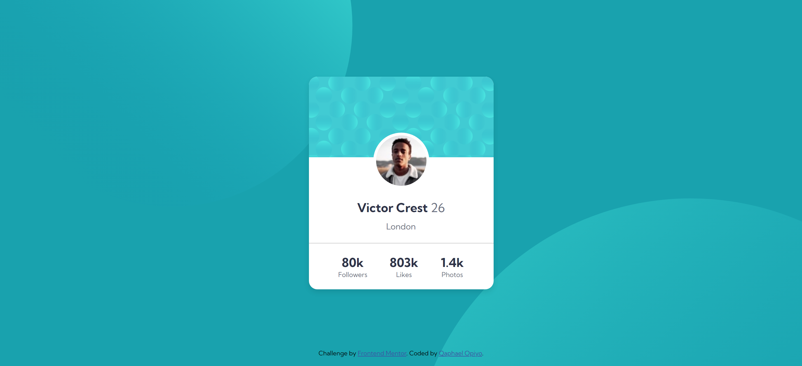

# Frontend Mentor - Profile card component solution

This is a solution to the [Profile card component challenge on Frontend Mentor](https://www.frontendmentor.io/challenges/profile-card-component-cfArpWshJ). Frontend Mentor challenges help you improve your coding skills by building realistic projects.  

## Table of contents

-   [Overview](#overview)
  - [The challenge](#the-challenge)
  - [Screenshot](#screenshot)
  - [Links](#links)
  - [Built with](#built-with)
  - [What I learned](#what-i-learned)
  - [Useful resources](#useful-resources)
  - [Author](#author)


## Overview
This is the front end mentor challenge recreation of Profile card component solution I did following my other frontend mentor code challenges

### The challenge

Users should be able to:

- View the optimal layout for the interface depending on their device's screen size
- See hover and focus states for all interactive elements on the page

### Screenshot




### Links

- Solution URL: [Add solution URL here](https://your-solution-url.com)
- Live Site URL: [Add live site URL here](https://your-live-site-url.com)

## My process

### Built with

- Semantic HTML5 markup
- CSS custom properties
- Flexbox
- CSS Grid
- vscode

### What I learned

I learned and practiced a great deal of flex property in this challenge for positioning
I learnt how to use and put images as backgrounds and also posotion them in the background.

```html
<h1>Some HTML code I'm proud of</h1>

<!-- photos -->
<div class="photos analytics-container">
  <span class="numbers">1.4k</span>
  <span class="label">Photos</span>
</div>

```
```css
.proud-of-this-css {
  color: papayawhip;
}

body {
    font-family: var(--Family);
    height: 100vh;
    display: flex;
    align-items: center;
    justify-content: center;
    flex-flow: column;
    background-color: var(--Dark-cyan);
    background-image: 
        url(/images/bg-pattern-top.svg), 
        url(/images/bg-pattern-bottom.svg);
    background-position: 
        top left,
        bottom right;
    background-repeat: 
        no-repeat;
    background-size: 
        650px,
        1000px;
    background-position: 
        top -280px left -20px,
        bottom -700px right -300px;
    transition: all 1s ease;
}

```

### Useful resources

- [google fonts](https://fonts.google.com/) - This helped me for fonts i used in this challenge.

## Author

- Website - [Qaphael Opiyo](https://qaphael-portfolio-website.web.app/)
- Frontend Mentor - [@Qaphael](https://www.frontendmentor.io/profile/Qaphael)
- Twitter - [@laflo__lr](https://twitter.com/Laflo_lr)
- Github - [@Qaphael](https://github.com/Qaphael)

